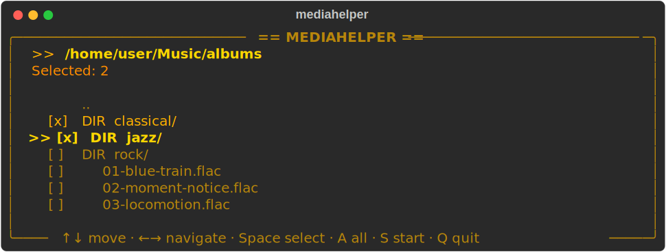
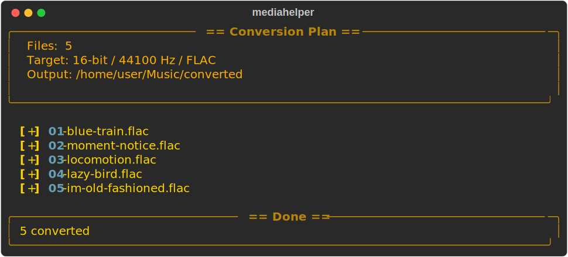

# mediahelper

A retro-styled command-line tool for converting audio files. Features an interactive file picker, format/quality selectors, and a progress display — all wrapped in an amber CRT terminal aesthetic.

<p align="center">
  
</p>

## Requirements

- Python 3.10+
- ffmpeg (`sudo apt install ffmpeg`)

## Installation

```bash
pip install -e .
```

Or install globally with pipx:

```bash
pipx install .
```

## Usage

### Interactive mode (recommended)

Just run `mediahelper` with no arguments. You'll be guided through:

1. **File picker** — browse and select files/folders with keyboard navigation
2. **Format selector** — choose FLAC, WAV, or ALAC
3. **Bit depth** — keep original or pick 16/24/32-bit
4. **Sample rate** — keep original or pick from 44.1kHz to 192kHz

<p align="center">
  
</p>

Conversion runs in parallel with a live progress display:

<p align="center">
  
</p>

### Direct mode

Skip the interactive prompts by passing paths and options directly:

```bash
# Convert FLAC files to 16-bit / 44.1kHz
mediahelper audio ~/Music/album/ -b 16 -r 44100

# Convert specific files to 24-bit / 48kHz
mediahelper audio track1.flac track2.flac -b 24 -r 48000

# Convert to WAV format with custom output directory
mediahelper audio ~/Music/ -f wav -b 24 -o ~/converted/

# Keep original specs, just change format to ALAC
mediahelper audio ~/Music/album/ -f alac

# Preview what would happen (dry run)
mediahelper audio ~/Music/ -b 16 -r 44100 --dry-run

# Parallel conversion with 8 workers
mediahelper audio ~/Music/ -b 16 -r 44100 -j 8
```

## Options

| Flag | Description |
|------|-------------|
| `-b, --bit-depth` | Target bit depth: 16, 24, or 32 (default: keep original) |
| `-r, --sample-rate` | Target sample rate: 44.1–192kHz (default: keep original) |
| `-f, --format` | Output format: flac, wav, alac (default: flac) |
| `-o, --output-dir` | Output directory (default: `converted/` subfolder next to source) |
| `--overwrite` | Overwrite existing output files |
| `-j, --jobs` | Number of parallel workers (default: CPU core count) |
| `--dry-run` | Show conversion plan without executing |
| `--picker` | Force interactive picker even when paths are provided |
